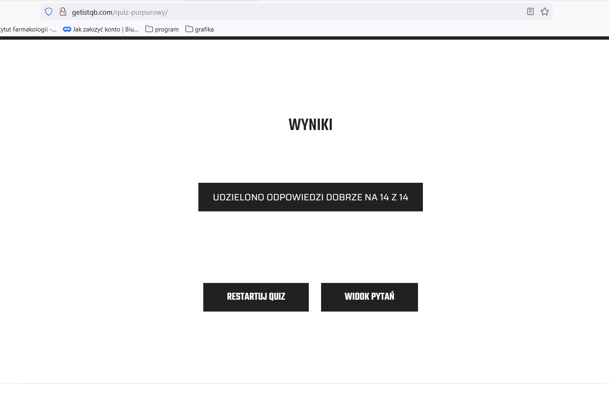

# Task 1: Konfiguracja oprogramowania

## Subtask 1: Dlaczego zdecydowałam się wziąć udział w wyzwaniu Dare IT Challenge?
Zastanawiam się nad zmianą pracy i branży. Mieliśmy 
szkolenie w pracy powiązane z programowaniem i IT, 
co zawsze mnie ciekawiło, ale nigdy nie miałam okazji 
próbować. Chciałam przekonać się jak praktycznie wygląda 
testowanie, do tego lubię wyszukiwać szczegóły i błędy 
oraz nie boję się klikać 😃

## Subtask 2: nie dotyczy

## Subtask 3:
Wynik testu purpurowego: 14/14

# Task 2: Selektory

## Subtask 1: Zadanie dodatkowe —> Nowy branch

## Subtask 2: Wyszukiwanie selektorów na stronie logowania
https://scouts-test.futbolkolektyw.pl/en/login?redirected=true
### Pole do wpisania loginu:
login_field_xpath
* //*[@id="login"]

* //*[@name="login"]

* //*[@type="text"]

### Pole do wpisania hasła:
password_field_xpath
* //*[@id="password"]

* //*[@name="password"]

* //*[@type="password"]

### Hiperłącze "Przypomnij hasło":
remind_password_hyperlink_xpath
* //*[@id="__next"]/form/div/div[1]/a

* //*[text()="Remind password"]

* //*[contains(@class, "MuiTypography-root MuiLink")]  

### Lista wyboru języka:
language_selection_dropdown_xpath
* //*[@id="__next"]/form/div/div[2]/div/div

* //*[@aria-haspopup="listbox"]

* //*[contains(@class, "MuiSelect-root MuiSelect")] 

### Przycisk wyboru j. angielskiego:
language_English_button_xpath
* //*[@data-value="en"]

* //*[@id="menu-"]/div[3]/ul/li[2]

### Przycisk wyboru j. polskiego:
language_Polish_button_xpath
* //*[@data-value="pl"]

* //*[@id="menu-"]/div[3]/ul/li[1]

### Przycisk "Zaloguj":
sign_in_button_xpath
* //*[@id="__next"]/form/div/div[2]/button/span[1]

* //*[contains(@class, "MuiButton-label")] 

* //*[text()="Sign in"]

## Subtask 3: Dodawanie selektorów do projektu

## Subtask 4: Dodanie nowego pliku - dashboard

## Subtask 5: Dodanie nowego pliku - add a match form

# Task 4
[Link do dysku Google z TC](https://docs.google.com/spreadsheets/d/14J4yXBMRoxodTpoGl9vdnmrYKGbPwNlvBp94WR_bpdI/edit?usp=sharing)
